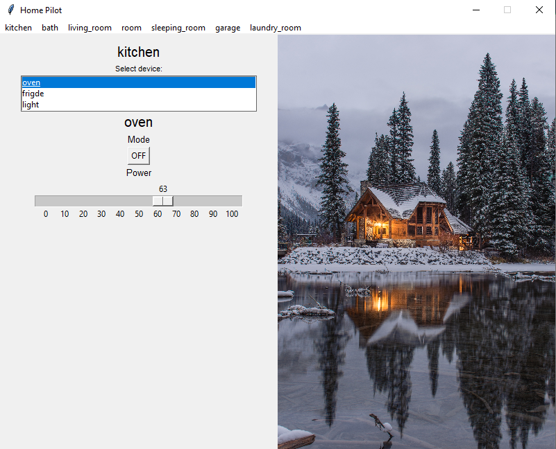

# Intelligent RCD

Project for Python Classes

## Technologies

- Python
- Mosquitto MQTT Broker
- MongoDB

## Installation

```bash
pip install -r requirements.txt
```

## Configuration

- Install [mosquitto](https://mosquitto.org/download/)
- Run mosquitto locally or replace connection link with your cloud MQTT broker
- Make sure mosquitto is running (type in command line **netstat -a | find "1883"** [Windows], status should be LISTENING)
- Register to [MongoDB Atlas](https://www.mongodb.com/cloud/atlas) and replace connection link in code with your own
- create file **private.json**

```json
{
  "password": YOUR_PASSWORD
}
```

## Using

### Windows

```bash
python pilot.py
```

### MacOS / Linux

```bash
python3 pilot.py
```

## Photos


