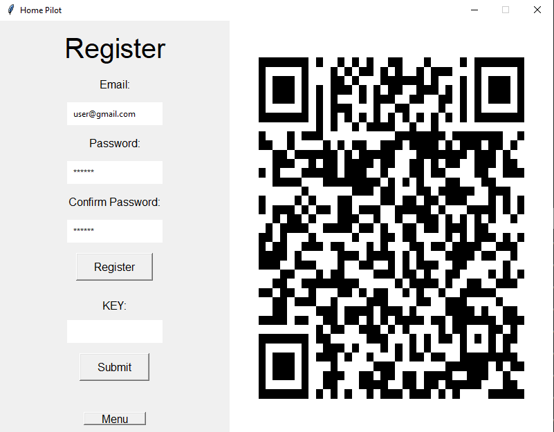

# Intelligent RCD

_Mateusz Surjak_

Project for Python Classes

Aplikacja służąca do komunikacji z Brokerem MQTT, wysyłająca do niego komunikaty oraz nasłuchująca na zdarzenia.

Aplikacja zawiera dwuetapową autentykację

## Technologie

- Python
- Mosquitto MQTT Broker
- MongoDB
- FreeOTP

## Instalacja

```bash
git clone git@github.com:surjak/IntelligentRCD.git

cd pilot_mqtt

pip install -r requirements.txt
```

## Konfiguracja

- mosquitto musi działać lokalnie na porcie 1883
- otworzyć plik private.json i zastąpić hasło do mongoDB atlasu swoim własnym
- następnie uruchamiamy aplikację (poniżej komenda)

## Uruchamianie

### Windows

```bash
python pilot.py
```

### MacOS / Linux

```bash
python3 pilot.py
```

## Przewodnik

- Klikamy w Register w menu
  

- Skanujemy kod QR w aplikacji FreeOTP na telefonie (lub też nie wykonujemy rejestracji i logujemy się klikając w przycisk `menu` a następnie `login` oraz skanujemy kod QR z poniższego zdjęcia)

```txt
login: user@gmail.com
hasło: ala123
```



- Wpisujemy kod wygenerowany przez aplikację FreeOTP
  
- Z górnego paska wybieramy zakładkę do której chcemy nawigować
  
- Możemy korztać z aplikacji!
  

# Uwagi

Aplikacja nasłuchuje na zdarzenia wysyłane z urzadzeń, ich stan jest na bieżąco aktualizowany, poniżej prezentuję przykląd który warto wynokać w celu obserwacjio działania nasłuchiwania

- Wchodzimy w jakas zakładkę np. `room`
- Otwieramy terminal i nawigujemy do folderu w którym jest mosquitto (chyba że zadziała bez tego)
- Wpisujemy komendę:

```bash
mosquitto_pub -t room/light/mode -m "OFF"
```

lub

```bash
mosquitto_pub -t room/light/mode -m "ON"
```

Aplikacja sama zmieni nam stan urządzenia


## Dostępne opcje

Prezentuję przykładowy plik konfiguracyjny

- każde jedno pomieszczenie składa się z `name` oraz `devices` które jest tablicą
- devices zawira obiekty które są urządzeniami
- każde urządzenia ma pewne opcje - mode - stan urządzenia (włącznik/wyłącznik) - power - slider odpowiadający za natężenie/moc - color - tablica możliwych kolorów
  Poniżej jest przykłądowy wygląd pliku konfiguracyjnego, cały plik jest 

Są to wszystkie dostępne opcje, w parametrze `mode` ustawiamy stan początkowy - "ON" lub "OFF"

```json
[
  {
    "name": "kitchen",
    "devices": [
      {
        "device": "oven",
        "options": {
          "mode": "OFF",
          "power": true
        }
      },
      {
        "device": "frigde",
        "options": {
          "mode": "ON",
          "power": true
        }
      },
      {
        "device": "light",
        "options": {
          "mode": "OFF",
          "color": ["White", "Red", "Yellow"]
        }
      }
    ]
  },
  {
    "name": "bath",
    "devices": [
      {
        "device": "light",
        "options": {
          "mode": "OFF",
          "color": ["White", "Red", "Yellow"],
          "power": true
        }
      },
      {
        "device": "shower",
        "options": {
          "mode": "OFF",
          "power": true
        }
      }
    ]
  }
]
```

## Informacje

- Aplikacja działa w oparciu o Mosquitto mqtt broker
- Aplikacja w celu authentykacji użytkowników korzysta z bazy danych mongoDB, a dokładnie z mongoDB Atlas (żeby nie trzeba było ściągać)
- Należy pobrać aplikację FreeOTP - jest dostępna zarówno na Androida jak i na IOS
